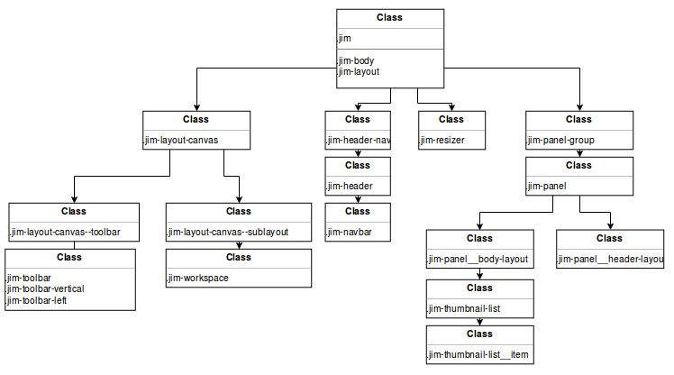
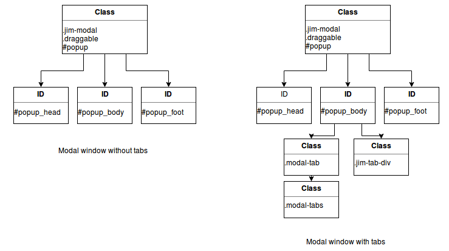
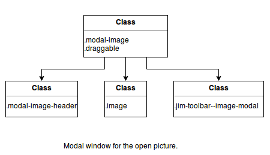
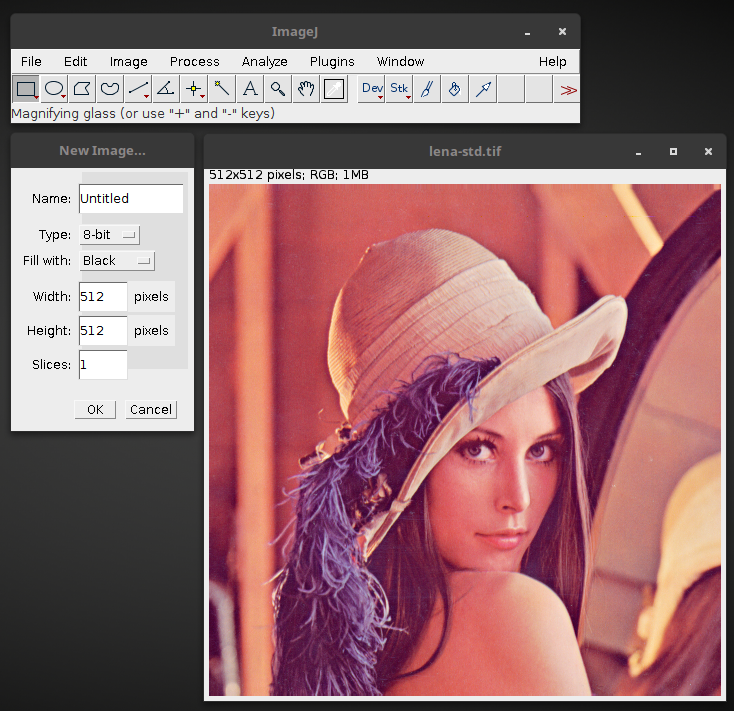
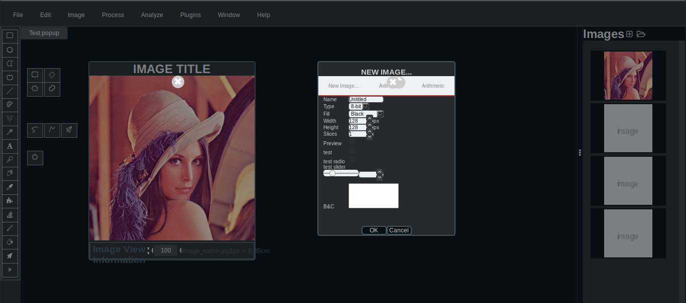
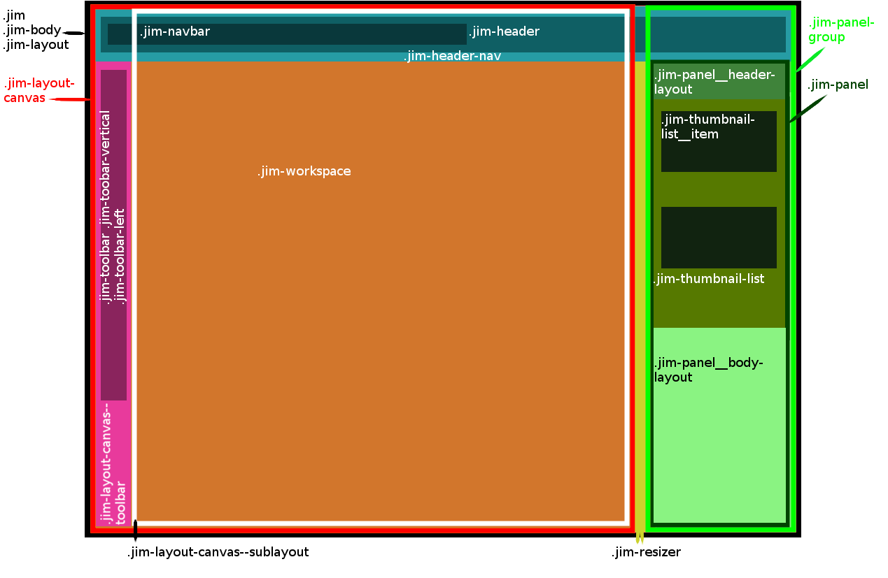
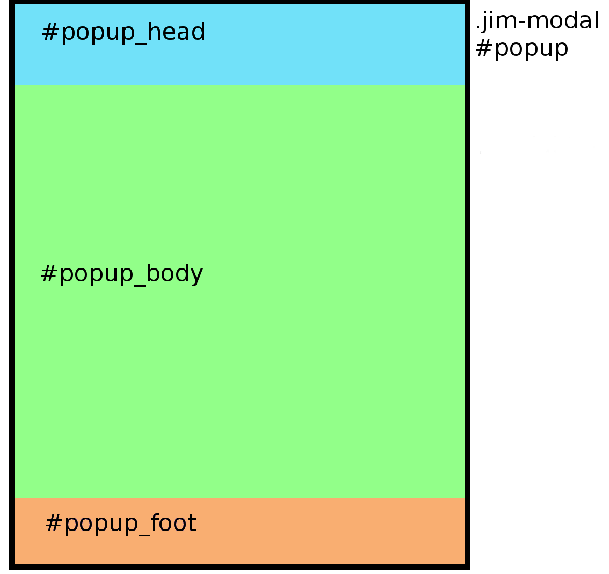
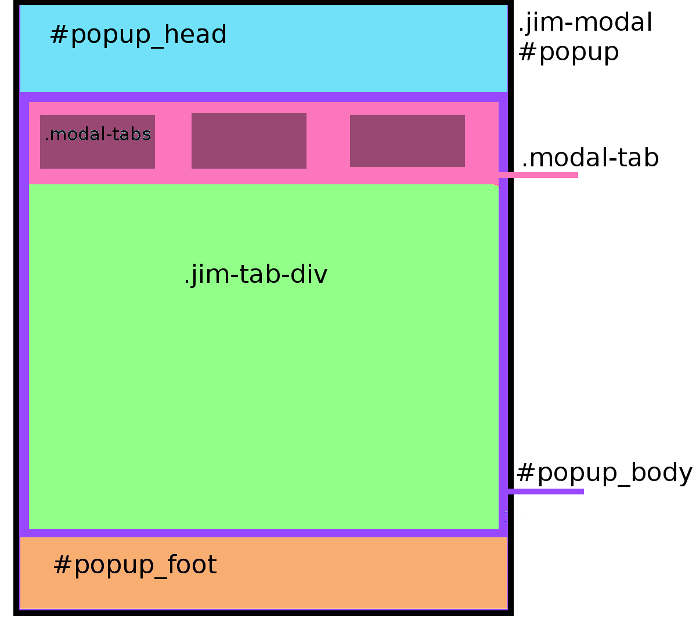
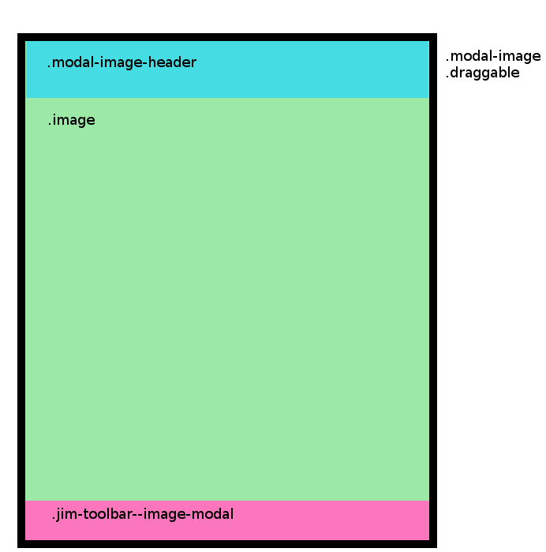

# JIM Online editor based on ImageJ

*Written by Amelie Laporte under the supervision of Jean-Christophe Taveau*

## Introduction

ImageJ [1] is a well know software of image processing that is studied during the master degree of bioinformatics of Bordeaux. This software is useful in the scientific community because it allows the processing of pictures that are generated in scientific experiments such as microscopic images or petri dish photographies to count or measure objects of interest.
For non initiated students, the utilization of ImageJ might be difficult because even though it is a powerful software it is not as intuitive as other mainstream photo editors due to the numerous amount of function that are not available in these ones.
To facilitate the learning process of ImageJ to the new students of the master of bioinformatics of Bordeaux this project was created. Its purpose is to produce a web version of ImageJ, including the most useful function of the software in a more intuitive display that does not require any installation on the computer and that is easily accessible. 
The project was separated in 2 parts:
The first one is to create a stable web interface and the second part is to implement the functions of ImageJ on the website.

This report will focus on the first part of the project. The first objective was to find a intuitive way to display all the information available in ImageJ on one screen and the second objective was to create the website and to add all the events that are indispensable for its functioning.

## Conception

In order to create a clean interface, different ideas were studied, especially about how the pictures would be treated if many of them were opened. First, a tile layout was thought about but the algorithm forced the program to modify the size of each open picture every time a new one was open or a picture was used as the active one to work on. Then we thought about creating a panel were all the images would be contained and we could navigate through them thanks to a scroll bar like it is usually done in video editing softwares and it would allow to open several images in the "active" workplace, where each active image is contained inside a modal element displaying all the useful information of the picture.
After some research on how other online photo editors were answering this problem I found a codepen created by Brandon Patram [2] that correspond to the idea I wanted to implement so I adapted his code to the project.

In ImageJ, almost every function in the menu opens a new window with the properties available so the main part of this project was to find a way to develop a function that generates automatically a modal window when a function of the menu was called.For doing so, the information necessary where stocked in JSON format because JSON objects are easily translatable into HTML elements using Javascript [3]. 

Concerning the menu, it was important to keep the same disposition and names than ImageJ so that user that would be first introduce to ImageJ by the use of the JIM website would not be lost in the use of the original software. The toolbar however was move on the left part of the screen to replicate the look of mainstream photo editor software and its use was simplified as a cascade menu in order to avoid the use of too many keyboard shortcuts that might not be available on every OS.

The script for the JIM website was separated in 4 different scripts:

- The HTML index containing the general layout of the website: index.html
- The stylesheet: style.css.
- A script for the function that generates the modal windows: createmodal.js
- A script for all the events necessary to the good functioning of the site: event.js.
Also, a package called "draggabilly" was imported to make the modals draggable. [4]

All these scripts are available at: https://github.com/crazybiocomputing/tijapi/tree/master/JIM%20Amelie .

## Realization

First, the layout was written in HTML with different containers separating each part of the website then the style was done with the flex method in CSS [5], this method is used to accommodate efficiently and easily the website on different screen size and display devices.

The structure of the JIM website is presented in the following diagrams (Figure 1 to 3) and a schematic version is available in the Supplemental Material (Figure 1 to 4):

Figure 1: UML structural diagram of the general layout of the JIM website.

Figure 2: UML structural diagram for the modal windows without or with tabs.

Figure 3: UML structural diagram for the image windows.

For example, if the user wants to open a new image, he clicks on the test button, that will trigger the createmodal.js function, this function will take the JSON object containing all the information to create the New image menu and will create all the HTML elements necessary. The new image menu will be generated instantly in the HTML page. All the modal windows have the same design generated by the stylesheet style.css and to close or reduce the modal, this is the event.js that will be triggered by using the ID or classname of the element.

This is illustrated by the following diagram.

Figure 4: Diagram illustrating a test case when the user wants to open the "new image" menu.

## Results

Figure 5: Screenshot of the original layout of ImageJ when a picture is active and  the "new image" menu is open.

Figure 6: Screenshot of the JIM website when an image is active and the "new image" menu is open.

## Conclusion

In conclusion, the website still needs a lot of work to finish the implementation of the events, finishing the toolbar, creating shortcuts on the modal windows of the pictures and implementing all the keyboard shortcuts.Also, the code can still be simplified.

We thought about creating a "diagram" mode where we can create a visual pipeline of image edition based on the post-processing part of blender where all the menus are linked between themselves. For that it would be interesting to create a button to switch mode between the normal and the "blender like" mode. Because in the normal mode the background tasks are deactivated when a pop up menu is open.

## Bibliography

[1] https://imagej.nih.gov/

[2] https://codepen.io/bpatram/pen/VeLXrb

[3] http://eloquentjavascript.net/

[4] https://github.com/desandro/draggabilly

[5] https://developer.mozilla.org/en-US/docs/Web/CSS/CSS_Flexible_Box_Layout/Using_CSS_flexible_boxes

## Supplemental material

Figure 1: Layout of the JIM website.

Figure 2: The layout of the modal windows generated by the createmodal.js function.

Figure 3: The layout of the modal windows generated by the createmodal.js function when the modal is tabbed.

Figure 4: The layout of the modal windows for the active picture.
